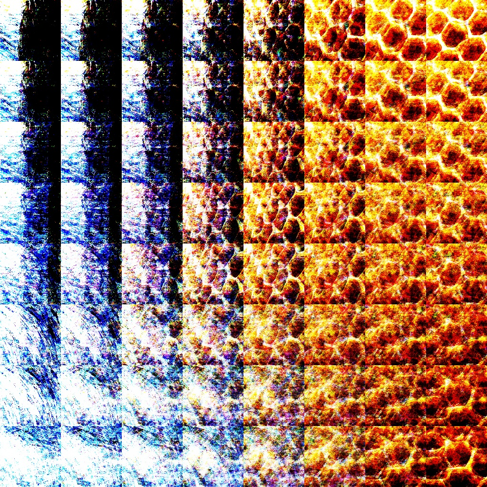
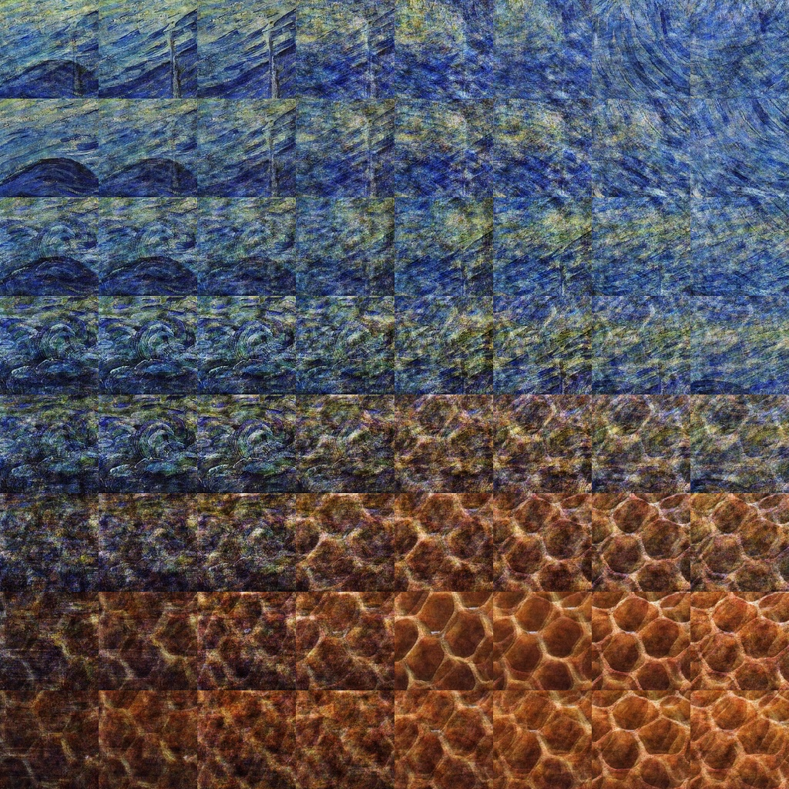
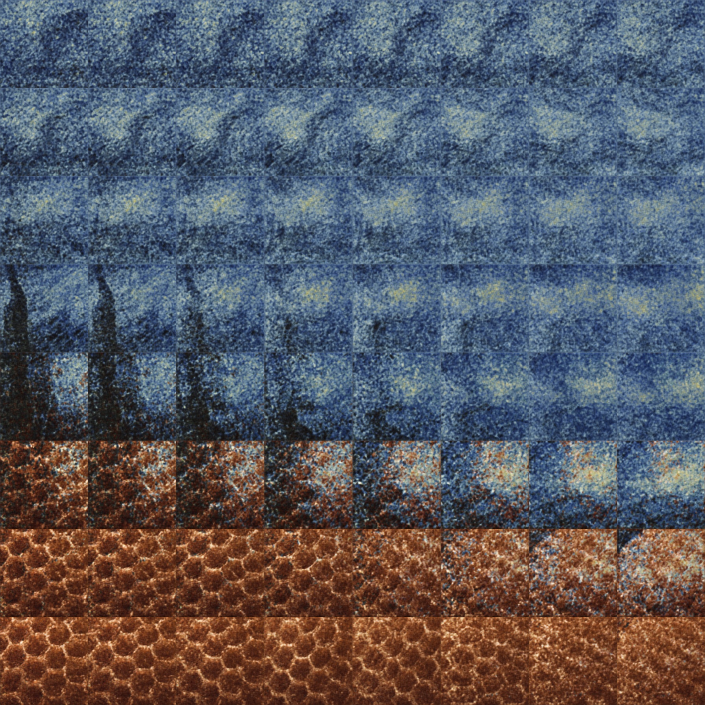

## Multi-Style Stylizer Network for Style Transfer

### Overview

The idea behind this project is to use the concept from **Perceptual Losses for Real-Time Style Transfer and Super-Resolution** in conjunction 
with output produced by a VAE to train a stylizer network that's able to produce outputs stylized by styles that are sampled by interpolating
between two base style's latent vector encodings on the aformentioned VAE.

For reference, **Perceptual Losses for Real-Time Style Transfer and Super-Resolution** (https://arxiv.org/abs/1603.08155) trains a stylizer network 
to produce the same stylization of a content image as is produced during style transfer (https://arxiv.org/abs/1508.06576). This stylizer is trained
on a single style and reduces time to stylize content images by up to factors in the hundreds.

The multi-stylizer for this project is trained on 224x224x3 style and content data. Style data is generated by a VAE (see below) and content data is
from the COCO dataset. The multi-stylizer isn't complete yet (still trying different stylizer architectures single-style stylizer up to par). Since
the multi-stylizer is going to be fully convolutional, single node inputs per style can't be provided as style selectors. To get around this, the 
current plan is to pre-process input images by adding the style selection as additional channels after RGB. This will probably take the form of an 
addtional channel per style with every value in that channel being a decimal [0:1] representing strength of that style to use. Alternatively,
for two styles, a single additional channel can be used to represent the balance between two styles.

Style training data is sampled from a VAE which was trained on randomly sampled 224x224 regions from (currently) two style sources: Starry Night and 
Honeycomb. These style samples are generated by sampling batches of latent vectors from the (normal) distributions from each style's latent vector
encodings, pairing random samples from each style to one of the other, then incrementally interpolating along the vectors between paired samples and
sampling VAE output at those latent vector positions.

Much of the final version of the models are written to use Eager Execution. Why? I hadn't used eager execution before and wanted to.

### Other Things

I also developed a visualization utility for viewing VAE interpolations between selected images' encodings. That's vae_keras_gui.

Also, there's a function in ImageUtilities for generating a .gif from a folder of images. Run this on a folder with incremental outputs from training 
for a neat little gif.

### Dependencies

pip install tensorflow matplotlib imageio opencv-python pyqt5

Optionally install tensorflow-gpu instead.

You might need the COCO dataset in res/coco/train2014/train2014 if you're wanting to train the stylizer network.

### Results

#### VAE output when using crossentropy in reconstruction loss - 128x128x3

This was an interesting output from the inital VAE (build for Session Execution rather than Eager Execution) when softmax_cross_entropy_with_logits loss was used. 
Currently, I'm attributing the odd outputs to the fact that the softmax_cross_entropy_with_logits is expecting logits as input but is receiving the output of sigmoid 
activation. This will probably be revisited at some point to produce some hellscape-esque artwork.

This was output from the inital VAE after switching to MSE loss.

#### VAE output when using MSE in reconstruction loss - 128x128x3

#### VAE output from VAE_Keras (using eager execution), input/output resolution of 224x224x3

Output from the keras based Eager Execution VAE for producing 224x224x3 outputs. The main architectural difference between this and the above mentioned VAE
was that there wasn't a final fully connected layer in this one. Taking that last FC layer out was necessary to scale up to this size with my GPU.

