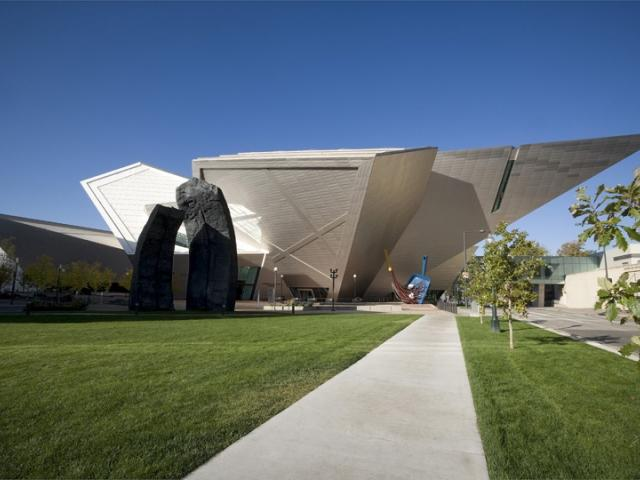
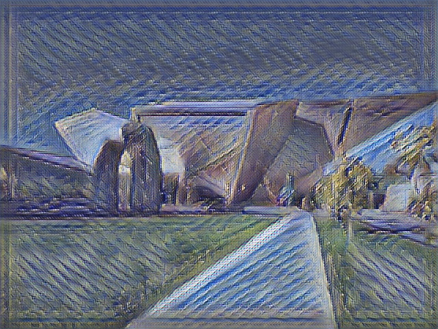
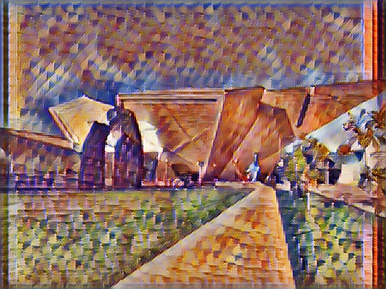
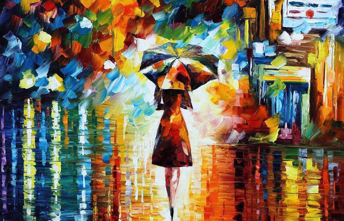
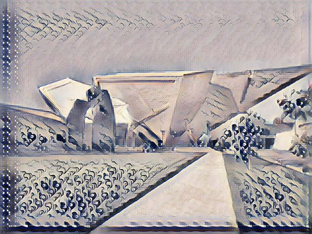
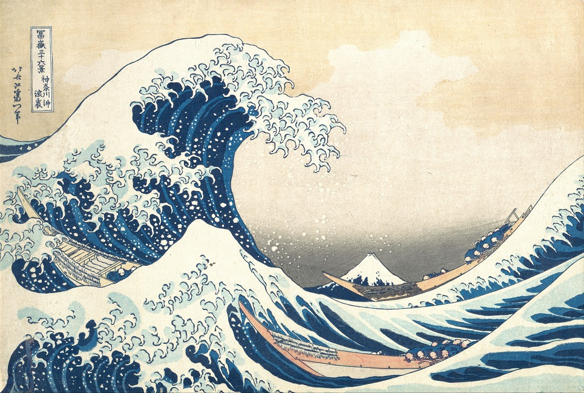

## Multi-Style Stylizer Network for Style Transfer

### Overview

**Perceptual Losses for Real-Time Style Transfer and Super-Resolution** (https://arxiv.org/abs/1603.08155) trains a fully convolutional
"style network" to produce the same stylization of a content image as is produced during style transfer (https://arxiv.org/abs/1508.06576). This style network
is trained on a single style and reduces time to stylize content images by up to factors in the hundreds, especially for larger images.

The idea behind this project *was* to use the concept from **Perceptual Losses for Real-Time Style Transfer and Super-Resolution** in conjunction
with output produced by a VAE to train a stylizer network that's able to produce outputs stylized by styles that are sampled by interpolating
between two base style's latent vector encodings on the aforementioned VAE. This isn't feasible, for reasons listed at the bottom of this page.

The idea being this project has now become to find a heuristic to determine style, content, and total variation loss weights which will lead to
style networks with better best qualitative results than would be found by evaluating style network outputs after training time and
adjusting weights until a network with acceptable outputs is found. Essentially, automatic hyperparameter tuning specific to style networks.

### Other Things

I also developed a visualization utility for viewing VAE interpolations between selected images' encodings. That's vae_keras_gui.

Also, there's a function in ImageUtilities for generating a .gif from a folder of images. Run this on a folder with incremental outputs from training 
for a neat little gif.

### Dependencies

pip install tensorflow matplotlib imageio opencv-python pyqt5 django

Optionally install tensorflow-gpu instead.

You might need the COCO dataset in res/coco/train2014/train2014 if you're wanting to train the stylizer network.

### Results

#### Some Style Network Outputs

#### VAE output when using cross-entropy in reconstruction loss - 128x128x3

This was an interesting output from the initial VAE (build for Session Execution rather than Eager Execution) when softmax_cross_entropy_with_logits loss was used.
Currently, I'm attributing the odd outputs to the fact that the softmax_cross_entropy_with_logits is expecting logits as input but is receiving the output of sigmoid 
activation. This will probably be revisited at some point to produce some hellscape-esque artwork.

This was output from the initial VAE after switching to MSE loss.

#### VAE output when using MSE in reconstruction loss - 128x128x3

#### VAE output from VAE_Keras (using eager execution), input/output resolution of 224x224x3

Output from the keras based Eager Execution VAE for producing 224x224x3 outputs. The main architectural difference between this and the above mentioned VAE
was that there wasn't a final fully connected layer in this one. Taking that last FC layer out was necessary to scale up to this size with my GPU.

### Design Decisions

#### Style Networks

The style network in this project uses a variation of the widely used 3-5-3 architecture where three convolutional layers feed into five residual blocks
which feed into three deconvolutional layers. Instead of three deconvolutional layers, my networks use a technique used by a few other implementations
which uses two deconvolutional layers followed by a final convolutional layer. I haven't conducted a full analysis of the results, but this change
seems to reduce the prevalence of output border artifacts.

Additionally, instead of using the typical `tanh` activation at the end of the style network, I decided to use `sigmoid`. This decision is fairly irrelevant
to the overall functionality, but the main influence was that I had infrastructure set up for saving and loading images with values normalized to [0,1]
so I stuck with that. Of course, this mandated a bit of intermediate processing before passing input into VGG-19 which expects inputs in range [-1,1].

Initially, an implementation goal was to use primarily eager execution rather than graph execution. The inspiration for this was me wanting to be lazy
and use the pre-trained Keras VGG-19 as well as a lot of other Keras functionality. Lots of Keras components, but also many aspects of Tensorflow feel
better to use from a functional programming perspective and are definitely more lenient with network configuration without too much of a performance hit.
Admittedly, you can use the pre-trained Keras VGG-19 in graph mode, but, again, eager execution feels very smooth and easy to use.

I ended up switching away from eager execution in favor of the increased control provided by graph execution. The main influence behind this was the desire
to be able to control filter weight initialization. I'm unsure if kernel initialization has much of an impact on quality of results, but I got that going for, which is nice.

I experimented with using both batch normalization and instance normalization. Batch normalized networks didn't tend to pick up as many of the macro-styles
in style images as did networks with instance normalization. Additionally, instance normalized network output tended
to converge faster. One thing I experimented with was putting normalization after activation. This, for a while, produced
completely unacceptable images with very odd, high frequency outputs. Since I abstracted much of network construction into
helper classes, I didn't realize that this meant the final layer was producing instance-normalized outputs rather than `sigmoid` outputs.
The amount of time I dumped into figuring out why these outputs were unacceptable has traumatized me to a point where I'm
not willing to analyze whether or not activation before normalization EXCEPT FOR THE FINAL LAYER produces better
qualitative results.

#### Hyperparameter Search and Tuning

I haven't started this portion of the project yet. Stay tuned.initialization

#### Hosting the Model

I decided to set up infrastructure to host the model through a Django server. I wanted the server to provide a webpage
with a dropzone (Dropzone.js) where users can drag and drop images they want stylized, then receive them as downloads
on the same page after stylization. However, this hasn't been completed since I've encountered issues where images
returned from the form POST containing the input images aren't served as downloads.

### Why The Original Purpose of This Project Isn't Feasible

Unfortunately, this project's initial purpose very feasible for two reasons. Firstly, with least importance, larger style images produce qualitatively better style outputs
for both the optimization-based and style-network-based style transfer. In this case, large is relative to the size of content image training data (256x256x3)
used to train the style network. While there isn't a line in the sand which separates "big enough" from "not big enough", bigger is better. In order to produce
a distribution of big enough style samples, the VAE used to sample style images must be increasingly big. The GPU used during training (GTX 1070) obviously
can't handle many VAEs producing style images in the "big enough" category. That's not a huge problem since it's not the end of the world to take a small
qualitative hit to style.

Secondly, with greater importance, training time and required memory for a style network for more than one image is likely to increase linearly per additional
style. Let's start with the very generous assumption that doubling the number of filters per layer in the network would allow the network to encode two images
with the same fidelity as two separate networks could encode the separate style. It is unlikely that a network with double the size wouldn't affect training
time, so let's make a less generous assumption that training time would also double. Based on my experience, training a style network takes between 95 and 120
minutes to train over a cumulative 80,000 images, depending on the style images (80 epochs x 1000 images; only 1000 images for memory reasons). This is fairly
consistent with **Perceptual Losses for Real-Time Style Transfer and Super-Resolution** which took "roughly 4 hours on a single GTX Titan X GPU"
(a slightly less powerful GPU than the GTX 1070) to train over two epochs of 80,000 images. That means training time is likely to be a minimum 4*S*T,
where S is the number of styles and T is the time to train a style network on a single style. My experience is that style network outputs seem to qualitatively
converge around 80,000 total training images, so let's assume T equals 2 hours. Given that, training time still blows up when training over a distribution
of style images. Having to recalculate style loss per sample in the style distribution could be mitigated by preprocessing style loss just like performance
can be increased preprocessing content loss for all images in the training set.

Regardless, drastically increasing network sizes and training times aren't worth it when the network is feasible, nor when the network isn't feasible.
When the network is trainable with a reasonable amount of compute (such as the amount provided by a GTX 1070), then a similar effect of the multi-style
network can be achieved by two networks with postprocessing that blends their outputs, but with less training time and more reliability coming from the
knowledge that paired networks are individually reliable. In the case where the network isn't trainable with a reasonable amount of compute, then the
network itself is guaranteed to be massive and thus difficult to deploy, but also very greedy in terms of compute required to train. **VERY** greedy.

#### But, If I Did It,

The multi-stylizer would be trained on 256x256x3 style and content data. Style data is generated by a VAE (see above) and content data is
from the COCO dataset.  Since style networks are fully convolutional, single node inputs per style can't be provided as style selectors. To get around
this, the idea would be to pre-process input images by adding the style selection as additional channels after RGB. This will probably take the form of an
additional channel per style with every value in that channel being a decimal [0,1] representing strength of that style to use. Alternatively,
for two styles, a single additional channel can be used to represent the balance between two styles.

Style training data is sampled from a VAE which was trained on randomly sampled 256x256 regions from two style sources. Style samples are generated by
sampling batches of latent vectors from the (normal) distributions from each style's latent vector encodings, pairing random samples from each style to
one of the other, then incrementally interpolating along the vectors between paired samples and sampling VAE output at those latent vector positions.